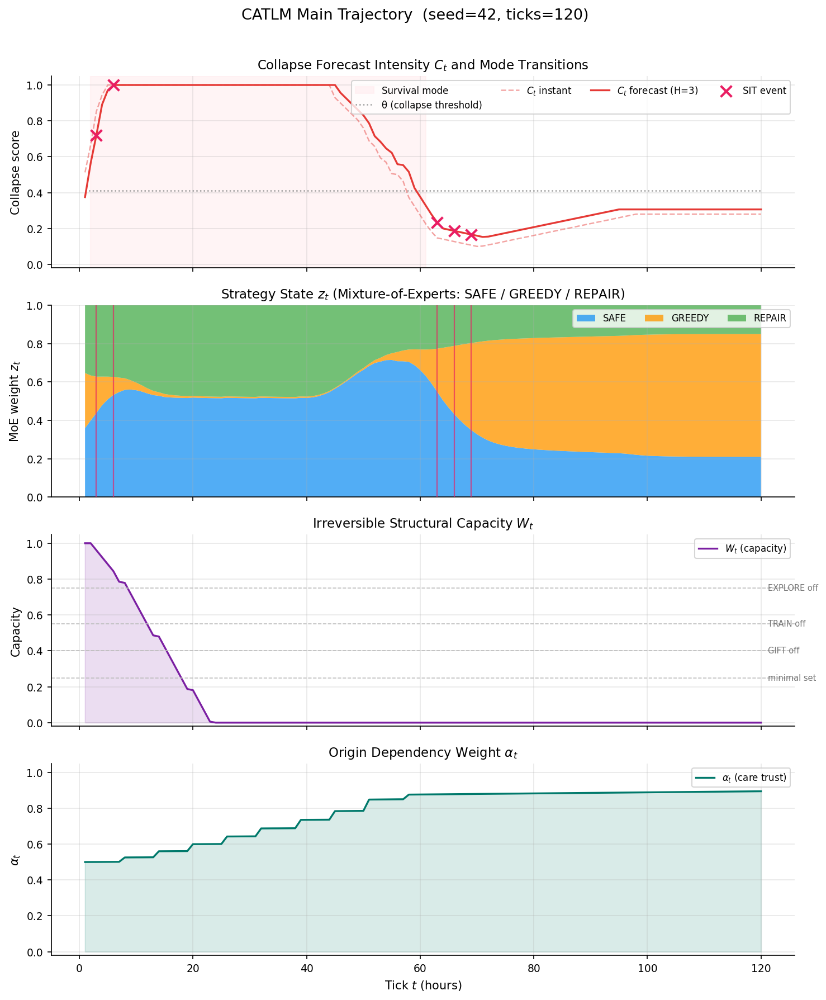
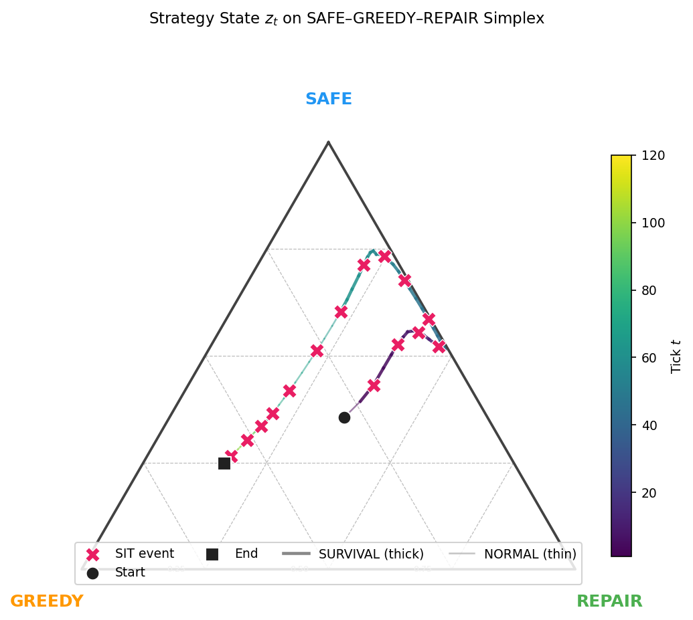
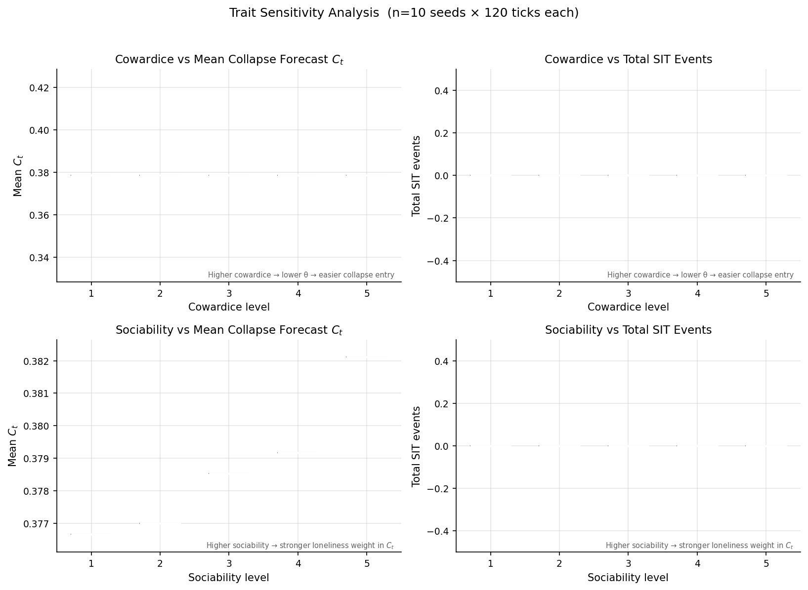
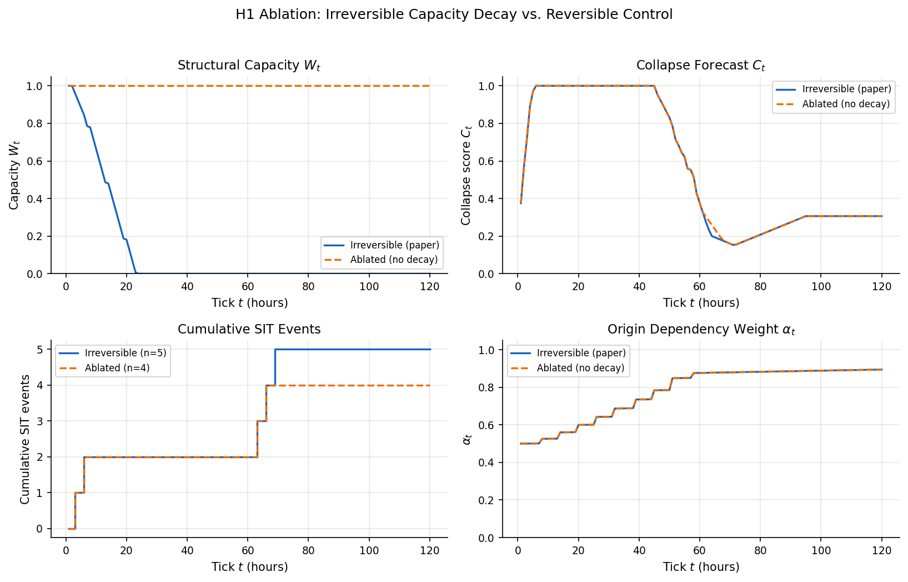
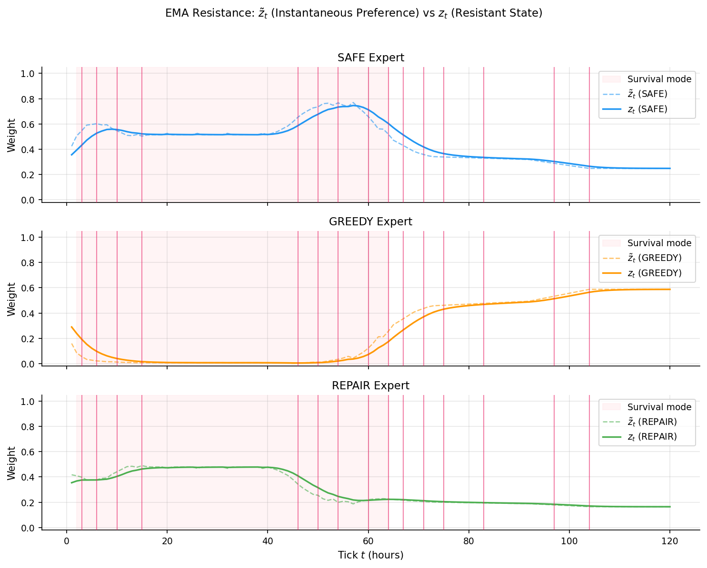

# CATLM — Structural Inference Transition Simulator

CATLM (Cat Adaptive Tiny Language Model) is a lightweight behavioral simulator designed to study **Structural Inference Transitions (SIT)** under **irreversible structural capacity constraints**.

The simulator models adaptive agents that dynamically shift between strategy modes (**SAFE / GREEDY / REPAIR**) in response to collapse forecasts and structural degradation.

The project accompanies the paper:

**Structural Inference Transitions Under Irreversible Survival Constraints**

---

## Example Simulation



Example trajectory showing:

* collapse forecast intensity (C_t)
* strategy mixture state (z_t)
* irreversible structural capacity (W_t)
* origin dependency weight (\alpha_t)
* detected SIT events

The system demonstrates how structural collapse pressure can trigger persistent strategy transitions in adaptive agents.

---

## Strategy Representation

Agent behavior is represented as a **mixture-of-experts strategy state**:

```
z_t = (SAFE, GREEDY, REPAIR)
```

Each component represents the weight of a behavioral mode:

| Mode   | Interpretation                  |
| ------ | ------------------------------- |
| SAFE   | risk avoidance / conservation   |
| GREEDY | resource seeking / exploitation |
| REPAIR | recovery / stabilization        |

Strategy states evolve continuously on a simplex.



---

## Structural Dynamics

The simulator tracks several interacting structural variables:

| Variable   | Description                      |
| ---------- | -------------------------------- |
| (C_t)      | collapse forecast intensity      |
| (z_t)      | strategy mixture state           |
| (W_t)      | irreversible structural capacity |
| (\alpha_t) | origin dependency weight         |

A **Structural Inference Transition (SIT)** occurs when the strategy state undergoes a **persistent structural shift** under collapse pressure.

---

## Why This Model Exists

Most behavioral simulations focus on optimizing performance or learning policies.
However, many real systems operate under irreversible structural constraints such as resource depletion, capacity decay, or survival pressure.

Under such conditions, agents may not simply adapt smoothly. Instead, they may undergo structural reorganization of their decision strategies.

The CATLM simulator was created to study this phenomenon in a minimal and interpretable setting.

Specifically, the model investigates whether:

collapse forecasts can influence strategy selection,

irreversible capacity decay alters feasible action spaces,

persistent strategy regimes can emerge from structural pressure,

and Structural Inference Transitions (SIT) can be detected as stable changes in behavioral dynamics.

Rather than focusing on large-scale neural architectures, the goal of CATLM is to provide a small, transparent simulator for studying structural transitions in adaptive agents.

---

## Running

```bash
python3 src/catlm_simulator.py
```

Outputs a per-tick log with columns:
`t  mode  Ct(fwd)  Ct(now)  stage  action  cap  alpha  safe_w  dstr  SIT#`

- `safe_w` — SAFE expert weight in z_t (high value = defensive strategy dominant)
- `dstr` — SIT displacement streak (ticks since z left current attractor basin)
- `SIT#` — cumulative SIT event count

---

## Experiments

Three experiments support the paper's empirical claims. Run all from the project root.

### EXP-001: SEED_SWEEP — H1 Effect-Size Analysis

Paired seed sweep comparing Irreversible (decay enabled) vs Ablated (decay=0) conditions.

```bash
python3 src/exp_001_seed_sweep.py [--seeds N] [--ticks N] [--n-boot N] \
                                   [--eps EPS] [--cowardice N] [--sociability N] \
                                   [--neglect TICKS] [--no-pdf]
```

Outputs → `results/exp-001/`:
- `exp-001_per_seed.csv` — per-seed raw data (all metrics, both conditions)
- `exp-001_summary.txt` — Δ statistics + percentile bootstrap 95% CI report
- `exp-001_robustness.png/pdf` — histogram panels with CI bands (fig6)

### EXP-002: ROBUSTNESS_GRID — Parameter Robustness Sweep

Maps the region where H1 effects hold across a grid of SIT hyperparameters (`eps`, `k_persist`, `H`, `decay_crisis`).

```bash
python3 src/exp_002_robustness_grid.py [--seeds N] [--workers N] [--no-pdf]
```

Outputs → `results/exp-002/`:
- `exp-002_grid.csv` — per-cell summary statistics
- `exp-002_heatmaps.pdf` — heatmaps: eps×k per (H, decay, metric)
- `exp-002_readme.md` — effect-region summary



### EXP-003: NULL_FPR — False Positive Rate via Permutation

Permutation-based FPR measurement for the SIT detector. Tests three null conditions:
`NULL_CT_PERMUTE` / `NULL_OBS_PERMUTE` / `NULL_ZPREF_RANDOM`.

Key finding: real CATLM dynamics exhibit **attractor stability** — genuine strategy states persist longer than permuted baselines (real SIT count < null SIT count).

```bash
python3 src/exp_003_null_fpr.py [--seeds N] [--ticks N] [--neglect N] [--no-pdf]
```

Outputs → `results/exp-003/`:
- `exp-003_null_counts.csv` — per-seed SIT counts (real vs 3 null conditions)
- `exp-003_summary.json` — FPR, mean/median/std, Δmean, p-value (strict & exploratory)
- `exp-003_plots.png/pdf` — violin+histogram, FPR bar chart, Δmean panel

### Paper Figures

Generates all publication figures (PNG + PDF) from a single run.

```bash
python3 src/paper_figures.py [--output figures/] [--ticks 120] [--seed 42]
```

Generated → `figures/`:
| File | Description |
|------|-------------|
| `fig1_main_trajectory` | Ct / z_t / capacity / care_alpha over time |
| `fig2_moe_resistance` | EMA resistance: z̃_t (instantaneous) vs z_t (resistant) |
| `fig3_capacity_ablation` | Irreversible decay vs ablated control condition (H1) |
| `fig4_trait_sensitivity` | Mean Ct and SIT events across cowardice / sociability levels |
| `fig5_z_simplex` | z_t trajectory on SAFE–GREEDY–REPAIR simplex |

---

## Model Mechanisms

The CATLM simulator includes several key mechanisms:

### Collapse Forecasting

Agents estimate collapse pressure through a forecast variable:

```
C_t
```

Forecast intensity influences strategy transitions.

---

### Irreversible Capacity Decay

Structural capacity decreases over time:

```
W_t
```

This represents irreversible degradation of the agent's internal resources.

Example ablation comparison:



---

### Strategy Persistence

Strategy states resist instantaneous preference changes through **EMA resistance dynamics**.



This produces **persistent strategy regimes** rather than noise-driven transitions.

---

## Research Context

CATLM is a minimal simulator for exploring how **adaptive agents restructure strategy selection when operating under irreversible constraints**.

The project investigates whether structural collapse pressure can induce **persistent inference transitions** rather than transient noise-driven behavior.

The model intentionally favors **interpretability and structural dynamics** over high-dimensional neural architectures.

---

## Paper

**Structural Inference Transitions Under Irreversible Survival Constraints**

Preprint:

[(Zenodo / arXiv link)](https://zenodo.org/records/18809602)

---

## Code and Simulation Framework

GitHub repository: https://github.com/Claude-Kim/CATLM


---

## Citation

If you use this simulator in research, please cite:

```
Kim, Sung Bae.
Structural Inference Transitions Under Irreversible Survival Constraints.
```

---

## License

MIT License

---

## File Structure

```
src/
  catlm_simulator.py        — CATLMAgent, CatProfile, CatState, DialogueBank, demo
  sit_core.py               — SITCore, SITConfig, SITStepResult (environment-agnostic)
  exp_001_seed_sweep.py     — EXP-001: paired seed sweep for H1 effect-size
  exp_002_robustness_grid.py — EXP-002: hyperparameter robustness grid
  exp_003_null_fpr.py       — EXP-003: permutation-based FPR measurement
  paper_figures.py          — publication figure generation (fig1–fig5)
  catlm_web.py              — Streamlit web demo
  run_init.py               — reproducible run-seed + deterministic trait roll helper
dialogue_bank_512.json      — token bank for dialogue generation
figures/                    — generated paper figures (PNG + PDF)
results/                    — experiment output (CSV, JSON, plots)
  exp-001/
  exp-002/
  exp-003/
CATLM_concept_define.md     — domain specification document
CLAUDE.md                   — implementation guide
```

---

## Developer Notes

- **Game balance**: Adjust `ACTIONS_MATRIX` labels and `CAPACITY_DECAY_*` constants in `catlm_simulator.py`
- **SIT tuning**: Modify `SITConfig` fields (`eps`, `k_persist`, `lam`, `insight_phi`) in `CATLMAgent.__init__`; `sit_core.py` is environment-agnostic and requires no changes
- **Word pool**: Expand `dialogue_bank_512.json` (schema: `tokens[].{id, text, category, tone[], intensity, tags[]}`)
- **Batch replay**: Call `step(user_action=action)` directly; `tick(hours=n)` delegates internally for legacy compatibility
- **Recovery items (BM)**: Implement capacity recovery logic in `_tick_one()` — current capacity decay is unidirectional
- **Web demo**: Run `streamlit run src/catlm_web.py` for an interactive browser-based interface
